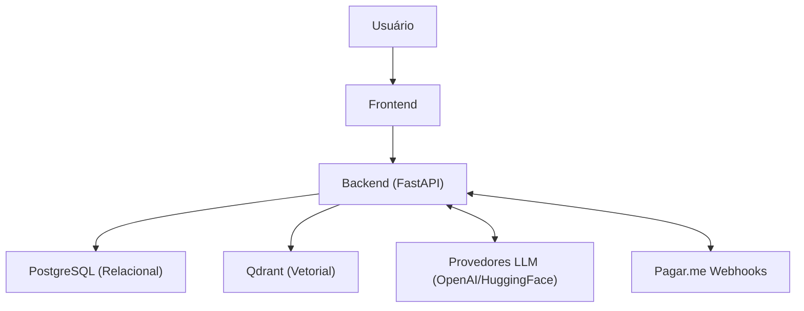

# MentorIA - Projeto Final de Curso II

## Visão Geral

Este projeto é a evolução e consolidação do desenvolvimento de uma aplicação avançada de **RAG (Retrieval-Augmented Generation)** integrada a um ecossistema de SaaS (Software as a Service) completo. O sistema permite a ingestão automatizada de bases de conhecimento personalizadas, processamento vetorial semântico e interação via chat inteligente.

Este projeto representa o **Projeto Final de Curso II (PFC II)**, culminando no fechamento de todo o escopo arquitetural, segurança, compliance de dados e integração de microsserviços.

## Funcionalidades Principais (Features)

A plataforma MentorIA cresceu exponencialmente em escopo para oferecer uma experiência de produto madura e pronta para produção:

### 1. IA e RAG (Retrieval-Augmented Generation)
- **Integração Agnóstica de LLMs:** Suporte multi-provedor (OpenAI, HuggingFace/Local LLMs, Gemini, Anthropic), permitindo flexibilidade de custos e privacidade.
- **Processamento Vetorial Híbrido:** Utiliza o **Qdrant** para armazenamento de embeddings de alta dimensionalidade, oferecendo buscas semânticas rápidas.
- **Auto-Ingestão de Dados:** Sistema que lê planilhas (XLSX, CSV) da pasta `data/`, converte para embeddings e auto-provisiona Bases de Conhecimento Públicas na inicialização do servidor.

### 2. Autenticação e Segurança Avançada
- **Autenticação JWT Robusta:** Controle de sessão, revogação de tokens e limitação de taxa (Rate Limiting) nativos.
- **2FA (Autenticação de Dois Fatores):** Segurança extra para os usuários ativarem no painel via autenticadores (Google Authenticator, Authy).
- **Detecção de Anomalias:** Bloqueio de IPs por excesso de tentativas falhas de login (Brute Force Protection) e requisitos de força de senha.

### 3. Monetização e Gateway de Pagamentos
- **Integração Completa Pagar.me v5:** Fluxo de assinaturas (Plans/Subscriptions) escalonado por níveis de uso (Level 01, 02, 03).
- **Checkout Seguro:** A aplicação gera o link de hosted checkout e processa os webhooks do Pagar.me, garantindo que nenhum dado sensível de cartão toque nossos servidores (PCI Compliance Indireto).

### 4. Conformidade Legal (LGPD) e Privacidade
- **Cookie Banner Nativo:** Gestão de consentimento transparente de cookies (somente essenciais no momento).
- **Portabilidade de Dados (Exportação):** Funcionalidade que permite ao usuário baixar instantaneamente todo o seu perfil, histórico de conversas e definições de bases de conhecimento em JSON.
- **Direito ao Esquecimento:** Funcionalidade real de exclusão de conta via painel (com token enviado ao e-mail para confirmação), disparando uma deleção em cascata (CASCADE) no PostgreSQL e no Qdrant.
- **Chats Somente Leitura:** Segurança a nível de backend que congela automaticamente a interação de conversas caso a Base de Conhecimento vinculada sofra restrições ou exclusões.

### 5. Interface de Usuário (Frontend)
- **Painel de Controle SPA (Single Page Application):** Desenvolvido inteiramente focado na responsividade e experiência moderna.
- **Modo Noturno (Dark Mode):** Alternância automática/manual perfeitamente integrada aos componentes.

---

## Arquitetura do Sistema

O sistema utiliza uma arquitetura de **Microsserviços Containerizados**, orquestrados via Docker Compose:

1. **Frontend (Web):** SPA desenvolvida em HTML5, CSS3, e TypeScript/JavaScript, servida nativamente ou em Next.js.
2. **Backend (API):** API RESTful assíncrona, orientada a eventos e desenvolvida com **FastAPI (Python 3.12)**.
3. **Banco de Dados Relacional:** **PostgreSQL 15** para armazenamento persistente e complexo (usuários, hierarquia de chats, histórico de pagamentos).
4. **Banco de Dados Vetorial:** **Qdrant** responsável pela pesquisa semântica da IA.



---

## Pré-requisitos

- [Docker](https://www.docker.com/get-started) e Docker Compose instalados.
- Git instalado na sua máquina.
- Chaves de API das integrações que você desejar ativar (ex: `OPENAI_API_KEY`, `PAGARME_API_KEY`).

---

## Como Executar o Projeto Localmente

1. **Clone o repositório:**

   ```bash
   git clone <URL_DO_REPOSITORIO>
   cd MentorIA
   ```

2. **Configure as variáveis de ambiente:**
   Duplique o arquivo `.env.example` e renomeie-o para `.env`. Preencha as chaves de API necessárias (como LLM e Pagar.me).

3. **Inicie a infraestrutura Docker:**

   ```bash
   docker-compose up --build -d
   ```

4. **Acesse a plataforma:**

   - **Frontend App:** [http://localhost:3000](http://localhost:3000)
   - **Documentação da API (Swagger UI):** [http://localhost:8000/docs](http://localhost:8000/docs)

---

## Configurações de Ambiente (.env)

O arquivo `.env` contém configurações vitais para rodar o sistema localmente ou em produção. Algumas das variáveis de destaque para controle de segurança e testes incluem:

- **DEV_MODE (`True`/`False`):** Controla o modo de desenvolvimento global. Ativar isso não mexe na segurança diretamente, mas serve como indicativo geral de debug.
- **SECURE_COOKIES (`True`/`False`):** Se `True`, todos os cookies de autenticação ganharão a flag `Secure` e exigirão conexão HTTPS para funcionarem. Em ambiente local sem certificado (HTTP), deixe como `False` para conseguir fazer login.
- **AUTO_RUN_SEEDER (`True`/`False`):** Se `True`, o backend engatilhará a ingestão automática das planilhas que estiverem na pasta `data/` logo após inicializar. Deixe `False` para economizar tempo no boot se o banco já estiver populado.
- **ENABLE_API_DOCS (`True`/`False`):** Ativa ou desativa as documentações interativas do FastAPI (Swagger/ReDoc). Em produção estrita, costuma-se manter `False`.
- **FORCE_HTTPS (`True`/`False`):** Se `True`, injeta um middleware no FastAPI forçando redirecionamento 301 de conexões HTTP para HTTPS e adicionando os cabeçalhos de segurança (HSTS).
- **SKIP_PAYMENT (`True`/`False`):** Utilidade maravilhosa para desenvolvimento: permite simular a conclusão instantânea de compras/assinaturas direto pelo painel, validando os webhooks locais sem bater no Gateway Pagar.me.

---

## Ingestão de Dados e Limpeza (Pasta `data/`)

O MentorIA já conta com um injetor automático poderoso de dados na pasta `data/`. Para subir novas bases de conhecimento públicas:
1. Jogue uma planilha `.xlsx` (com colunas de pergunta/resposta) dentro do diretório `data/`.
2. Habilite `AUTO_RUN_SEEDER=True` no seu `.env`.
3. Reinicie os contêineres e a API auto-ingerirá esses dados.

> **Dica Pro:** Para arquivos gerados a partir de extrações cruas (PDFs convertidos), utilize a ferramenta nativa de diagnóstico e limpeza do projeto para sanitizar os dados **antes** da ingestão:
> ```bash
> python data/analyze_spreadsheet.py "data/MEU_ARQUIVO.xlsx" --clean
> ```
> *(Veja mais instruções em `data/README.md`)*

---

## Qualidade de Código (Pre-commit & Testes)

Este projeto adota padrões extremamente rígidos de qualidade de software. É **obrigatório** instalar os hooks locais se for modificar o código.

### Como configurar os hooks locais:
```bash
# No Windows PowerShell:
.\setup_precommit.ps1
```

O ambiente executa de forma implacável:
- **Ruff:** Formatação unificada, remoção de imports não utilizados e linting rigoroso.
- **Mypy:** Checagem de tipagem estática (Type Hints) previnindo ambiguidades em tempo de execução.
- **Conventional Commits:** Todas as mensagens de commit devem seguir o padrão (ex: `feat: ...`, `fix: ...`, `docs: ...`).
- **Pytest:** Cobertura de testes automatizados e integração contínua (Integration/Unit Testing).

---

## Autores

- **Felipe Rocha Martins** - [GitHub](https://github.com/FelipeRochaMartins)
- **Gabriel Weidlich Santos** - [GitHub](https://github.com/GabrielWeidlich)
- **Adriel Fernandes Campos** - [GitHub](https://github.com/AdrielCampos134)
- **Hugo Gabriel Cunha Alves** - [GitHub](https://github.com/HugoTGabriel)

## Badges


