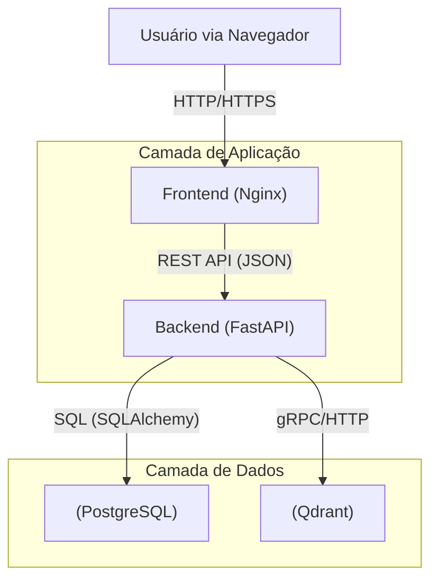

# Documento de Especificação do Projeto Integrador

## Fase 01 - 7º Período: Consolidação e Integração do Sistema

---

## 0. Histórico de Versão do Projeto

| Versão | Data       | Descrição                                                                                         | Autor     |
| :------ | :--------- | :-------------------------------------------------------------------------------------------------- | :-------- |
| 1.0     | 08/03/2026 | Entrega da Fase 01 do 7º Período: Consolidação da integração entre Frontend, Backend e Dados. | Techstein |

---

## 2. Planejamento do Semestre

### 2.1. Situação Atual do Projeto

O projeto encontra-se na fase de **consolidação e integração**. As camadas de Frontend e Backend, desenvolvidas nos semestres anteriores, foram unificadas em uma arquitetura de microsserviços containerizada. O sistema base de RAG (Retrieval-Augmented Generation) está funcional, permitindo a ingestão de documentos e a realização de chats contextualizados.

### 2.2. Objetivos do 7º Período

O foco deste semestre é garantir a **qualidade, segurança e escalabilidade** do sistema. Os principais objetivos são:

1. **Integração Completa:** Validar e otimizar a comunicação entre a interface web e a API de inteligência artificial.
2. **Qualidade de Software:** Implementar testes automatizados e melhorias de performance.
3. **Segurança:** Reforçar a autenticação (JWT), controle de acesso (RBAC) e proteção dos dados sensíveis.
4. **Monitoramento:** Estabelecer logs e métricas para acompanhamento da saúde do sistema.

### 2.3. Cronograma Macro

* **Fase 01 (Atual):** Integração e validação dos fluxos principais (Frontend + Backend + Banco de Dados).
* **Fase 02:** Implementação de testes, melhorias de segurança e tratamento de erros.
* **Fase 03:** Otimização de performance, documentação final e entrega do produto consolidado.

---

## 20. Arquitetura Geral do Sistema

A arquitetura do sistema foi consolidada seguindo o padrão de **Microsserviços Containerizados**, orquestrados via Docker Compose. O sistema é composto por quatro contêineres principais que se comunicam através de uma rede interna isolada (`rag_network`).

### 20.1. Diagrama de Componentes (Conceitual)

### 20.2. Componentes e Responsabilidades

1. **Frontend (Web Container):**

   * Servidor Nginx hospedando a aplicação SPA (Single Page Application).
   * Responsável pela interface do usuário, gestão de estado local e chamadas assíncronas à API.
   * Comunicação via porta 3000 (mapeada para 80 interna).
2. **Backend (API Container):**

   * Aplicação Python com FastAPI.
   * Gerencia regras de negócio, autenticação, pipeline RAG e orquestração dos modelos de IA.
   * Expõe endpoints REST documentados (Swagger UI).
   * Comunicação via porta 8000.
3. **Banco Relacional (PostgreSQL Container):**

   * Armazena dados estruturados: Usuários, Chats, Mensagens, Histórico de Uploads.
   * Persistência garantida via volumes Docker.
4. **Banco Vetorial (Qdrant Container):**

   * Armazena embeddings (vetores) dos documentos processados para busca semântica.
   * Permite a recuperação de contexto eficiente para o RAG.

---

## 21. Tecnologias e Ferramentas do Projeto

A stack tecnológica foi atualizada para refletir as ferramentas utilizadas na integração:

### 21.1. Frontend

* **Linguagens:** HTML5, CSS3, JavaScript (ES6+).
* **Servidor Web:** Nginx (Alpine Linux).
* **Estilização:** CSS nativo com variáveis (Custom Properties) para temas e responsividade.
* **Bibliotecas:** FontAwesome (ícones), Google Fonts (tipografia).

### 21.2. Backend & AI

* **Framework:** FastAPI (Python 3.12).
* **Gerenciamento de Dependências:** UV (Astral).
* **ORM:** SQLAlchemy (interação com PostgreSQL).
* **Migrações:** Alembic.
* **Vector Search:** Qdrant Client.
* **IA/LLM:** Suporte multi-provider (OpenAI, Ollama, Google Gemini).

### 21.3. Infraestrutura & DevOps

* **Containerização:** Docker e Docker Compose.
* **Banco de Dados:** PostgreSQL 15 (Relacional) e Qdrant (Vetorial).
* **Ambiente:** Variáveis de ambiente (.env) para configuração segura de credenciais.

---

## 22. Detalhamento da Implementação e Integração

### 22.1. Implementação Frontend

O frontend foi estruturado como uma **Single Page Application (SPA)** leve, sem dependência de frameworks pesados, garantindo alta performance e carregamento rápido.

* **Estrutura de Arquivos:** Organizada semanticamente em `/pages` (HTML), `/css` (Estilos), `/js` (Lógica) e `/assets` (Recursos).
* **Gerenciamento de Estado:** Classes gerenciadoras (`LoginManager`, `DashboardManager`) encapsulam a lógica de cada visão, mantendo o estado da aplicação e manipulando o DOM.
* **Interatividade:** Uso de *Event Listeners* para manipulação de formulários, navegação e feedback visual (toasts, spinners).
* **Design System:** Interface responsiva baseada em Flexbox/Grid, com tema consistente definido em variáveis CSS globais.

### 22.2. Implementação Backend

O backend atua como o núcleo de processamento do sistema, expondo uma API RESTful robusta.

* **Rotas e Endpoints:**
  * `/auth`: Autenticação e gestão de tokens JWT.
  * `/chats`: CRUD de chats e envio de mensagens com processamento RAG.
  * `/upload`: Ingestão de documentos e processamento em background (BackgroundTasks).
  * `/chat-types`: Gestão de bases de conhecimento.
* **Pipeline RAG:** Implementação modular que recebe a pergunta do usuário, converte em vetor, busca contextos relevantes no Qdrant, e envia o prompt enriquecido para o LLM.
* **Persistência:** Uso de sessões de banco de dados (`Session`) com injeção de dependência (`Depends`) para garantir transações atômicas e seguras.

### 22.3. Integração Frontend e Backend (Atualizado)

A integração entre as camadas foi estabelecida via protocolo HTTP/JSON, com as seguintes características validadas nesta fase:

1. **Comunicação Assíncrona:**

   * O frontend utiliza `fetch API` com `async/await` para consumir os endpoints do backend sem bloquear a interface.
   * Classe utilitária `makeApiRequest` centraliza as chamadas, tratando cabeçalhos de autorização (Bearer Token) e erros de rede.
2. **Fluxo de Autenticação:**

   * Frontend envia credenciais para `POST /api/v1/auth/login`.
   * Backend valida e retorna Token JWT.
   * Frontend armazena o token em `localStorage` e o anexa automaticamente em todas as requisições subsequentes via cabeçalho `Authorization`.
3. **Fluxo de Chat (RAG):**

   * Usuário envia mensagem no Dashboard.
   * Frontend dispara `POST /api/v1/chats/{id}/messages`.
   * Backend processa a mensagem, recupera contexto no Qdrant, gera resposta via LLM e salva o histórico no Postgres.
   * Resposta é retornada ao Frontend e renderizada em tempo real na interface de chat.
4. **Tratamento de Erros e Feedback:**

   * Erros de API (4xx, 5xx) são capturados pelo Frontend e exibidos ao usuário através de componentes de "Toast" (notificações flutuantes), garantindo uma experiência de usuário fluida mesmo em falhas.
   * Spinners de carregamento são exibidos durante a latência das requisições.

A integração está funcional e segue os contratos de interface definidos na especificação da API (Swagger), garantindo desacoplamento e facilidade de manutenção.
